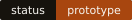
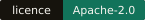
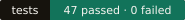
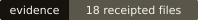

<div align="center">


# Checkable in an afternoon

**The GQODB open layer** · lossless market-data codecs, formats and their evidence






[Install](#build-it) · [Formats](#formats) · [Benchmarks](#benchmarks) ·
[Evidence](#evidence) · [Crates](#crates) · [Licence](#licence-and-the-engine)

</div>

---

GQODB stores market data the way research actually needs it: every record keeps the
bytes as they arrived, the moment they arrived, and the evidence for the clock that
measured it. This repository is the part of GQODB worth giving away — **the codec**:
the exact types, the lossless tick and order-book compression, the indexed segment
files, the format facade that reads them, and the benchmark protocols and evidence
behind every number below.

A codec is checkable in an afternoon, it is the part these benchmarks actually
measure, and every file it writes is a plain `.gqodb` file you can inspect without us.

> [!IMPORTANT]
> **A prototype, released as source.** There is no crates.io release, no signed
> artifact and no format-stability promise yet. The GQODB engine — raw journal,
> ledger and receipts, recovery, quality, features, causal query, ops and
> connectors — is **not** in this repository and is not licensed by it.

<table>
<tr>
<td width="33%" valign="top">

#### Exact or it fails

A price is an integer plus its scale. A round trip restores every value, null,
timestamp and float bit exactly — or it returns an error. Nothing is rounded to fit a
block, and a corrupt frame is refused rather than repaired.

`Functionally tested` — round trips, corrupt frames, truncated tails

</td>
<td width="33%" valign="top">

#### The header decides

Tick and order-book segments share `GQOBHDR1` framing, and the header — not the file
extension — selects the codec profile. Renaming a `.tick` file to `.ob` changes
neither its contents nor how it is read.

`Functionally tested` — profile selection from the header

</td>
<td width="33%" valign="top">

#### Every claim carries its receipt

Each figure names its run, its dataset and its boundary — including the runs where
Parquet wins. Eighteen result files are pinned by build receipts, and one script
recomputes every published number from them.

`Hash checked` — 18 of 18 receipted files verify

</td>
</tr>
</table>

## What is here, and what is not

| In this repository — Apache-2.0 | Not in this repository |
| --- | --- |
| `gqodb-types` — exact event and time types with explicit scales | The raw journal, ledger and durable receipts |
| `gqodb-blocks` — lossless codec kernels, tick and book profiles | Recovery of a live writer, quality checks and features |
| `gqodb-store` — indexed `.gqodb.ob` segments with range reads and prefix recovery | Causal as-of queries, ops and health assessment |
| `gqodb-codec` — the native format facade and file inspection | Venue connectors and the same-host shared-memory bus |
| Format notes, benchmark protocols, result files, receipts and a verifier | The GCO quant suite: backtest, paper execution, risk, models, experiments |

## Where it stands today

<div align="center">

| 4 | 47 | 18 | 0 |
|:---:|:---:|:---:|:---:|
| crates | tests passed, 0 failed | receipted result files | published releases |

<sub>Rust 1.96.0 · Linux x86_64 · 19 September 2026 · default build and `zstd-input` build both green</sub>

</div>

> [!NOTE]
> Read the numbers like an engineer, not a brochure. Benchmark figures are observations
> from named runs on one host with warm caches. The raw inputs are not redistributed:
> you can recompute every published figure from the stored results and check them
> against their receipts, but re-running B11–B15 from scratch needs a Bybit capture of
> your own.

## Build it

To build, test and install the two open command-line tools from a clean checkout:

```sh
./install.sh --prefix "$HOME/.local"
```

The installer requires Git and Rustup with Rust 1.96.0 already installed. It
installs `gqodb-codec` and `ob_store`, their licence files and a build receipt.
Existing binaries are refused unless `--force` is supplied. Use `--ref COMMIT`
to select an exact source revision; `./install.sh --help` lists the options.
This is a source installer, not a signed binary release.

For a manual build and direct file checks:

```sh
cargo build --workspace --bins --release --locked
cargo test  --workspace --all-targets --locked

# write, inspect and validate a native file; the extension is never trusted
target/release/gqodb-codec demo book-segment /tmp/demo.gqodb.ob
target/release/gqodb-codec inspect  /tmp/demo.gqodb.ob       # codec_profile: gqodb-book-runs-planes-lz4
target/release/gqodb-codec validate /tmp/demo.gqodb.ob orderbook
cp /tmp/demo.gqodb.ob /tmp/renamed.gqodb.tick
target/release/gqodb-codec inspect  /tmp/renamed.gqodb.tick  # still the book profile

# order-book segments: verify, recover the complete prefix into a new file, range query
target/release/ob_store verify  /tmp/demo.gqodb.ob                  # verified 1 blocks, 3 rows
target/release/ob_store recover /tmp/demo.gqodb.ob /tmp/recovered.gqodb.ob
target/release/ob_store query   /tmp/demo.gqodb.ob SYNTH 10 12      # 3 rows

# recompute every published figure and check it against its receipt
python3 results/verify_public_evidence.py
python3 benchmarks/verify_manifest.py
```

The tested toolchain is Rust 1.96.0 on Linux. The default build is pure Rust. The
original B06 trade samples were zstd-compressed Parquet; to read inputs like that, build
`gqodb-blocks` with `--features zstd-input`, which adds the native zstd library from
crates.io. It only decodes inputs and is never one of the measured codecs.

## Formats

| Format | Holds | Detected by |
| --- | --- | --- |
| `.gqodb.tick` | Native tick and trade segments with the adaptive tick profile | `GQOBHDR1` header, tick profile |
| `.gqodb.ob` | Native order-book segments with block index, range read and committed-prefix recovery | `GQOBHDR1` header, book profile |
| Arrow / Parquet | Exchange and benchmark reference, with exact scales and UTC nanoseconds | — |

Frames carry CRC checks; a physically incomplete tail is distinguished from a corrupt
frame, and recovery writes a new file instead of editing the old one. Nanosecond units
do not imply nanosecond accuracy. See the [block format](docs/B02_FORMAT.md), the
[block protocol](docs/BLOCK_PROTOCOL.md), the [tick profile](crates/gqodb-codec/src/tick/README.md)
and the [order-book profile](crates/gqodb-codec/src/orderbook/README.md).

## Benchmarks

The [benchmark inventory](benchmarks/README.md) and machine-readable
[manifest](benchmarks/manifest.json) map every cited run to tracked runner source,
protocols and stored evidence. CI fails if any declared benchmark file or any file
under `results/` exists outside Git.

Historical runs on fixed datasets and configurations, one host, warm caches. Every
figure below is recomputed from the stored JSON by `results/verify_public_evidence.py`.

The [benchmark inventory](benchmarks/README.md) maps each run to its runner,
protocol and input requirements. Use `./benchmarks/run.sh verify` to check the
published evidence, or `./benchmarks/run.sh synthetic-smoke` from a clean committed
checkout for a small synthetic check. Neither command downloads market data.

### Trades — GQODB wins every axis (B06)

> `results/b06` — 1,048,576 aggregate trades per sample (32 blocks), in-memory codec
> passes, one warm-up and nine measured passes per mode, medians. GQODB is compared per
> axis against the **strongest** of five Parquet configurations on that axis.

| Sample | Axis | GQODB | Strongest Parquet | Difference |
| --- | --- | ---: | --- | ---: |
| ETH | size | **5.089 MB** | normalized-LZ4, 5.464 MB | **−6.9%** |
| ETH | encode | **78.363 ms** | delta/BSS-Snappy, 146.439 ms | **−46.5%** |
| ETH | decode | **23.666 ms** | normalized-LZ4, 38.719 ms | **−38.9%** |
| UNI | size | **4.708 MB** | normalized-LZ4, 6.189 MB | **−23.9%** |
| UNI | encode | **65.478 ms** | delta/BSS-LZ4, 142.945 ms | **−54.2%** |
| UNI | decode | **21.277 ms** | delta/BSS-LZ4, 31.280 ms | **−32.0%** |

B06 has no build receipts: these figures are historically measured, not hash-checked.
[Assessment](results/b06/ASSESSMENT.md).

### Order books — a loss, and what changed

The same B06 run lost on order books: against dictionary-LZ4 Parquet the adaptive codec
was **22.6% larger** and decoded **22.5% slower**, winning only on encode. The next four
runs are the record of fixing that, one boundary at a time.

| Run | What changed | Size vs dictionary-LZ4 | Write | Read | Evidence |
| --- | --- | --- | --- | --- | --- |
| [B06](results/b06/ASSESSMENT.md) | adaptive codec, in memory | 22.6% larger | encode 7.0% faster than best | decode 22.5% slower | historically measured |
| [B11](results/b11/ASSESSMENT.md) | dedicated book profile, in memory | **38.4–42.9% smaller** | encode time −40% | decode **14.3–14.5% slower** | hash checked |
| [B12](results/b12/ASSESSMENT.md) | real `.gqodb.ob` files | 37.8% smaller | write + sync 28.5% less | full reads and window queries **slower** | historically measured |
| [B13](results/b13/ASSESSMENT.md) | reader rewrite, same file bytes | unchanged | unchanged | full reads 2.4–3.5× faster than B12 | hash checked |
| [B15](results/b15/ASSESSMENT.md) | six measured rounds on files | **37.75% smaller** | **36.67% less** | **3.96% less** | hash checked |

The in-memory decode loss of B11 is still there — Parquet decodes that projection faster
than both GQODB codecs. What B13 fixed is the file reader around it.

### Order-book files in detail (B15)

> `results/b15 · storage.json` — 1,048,576 Bybit level rows from 7,265 events, 32 blocks
> or row groups. One warm-up, six measured rounds, medians. Warm page cache, one host.
> File-sync counted; directory sync and physical power-loss qualification not.

| Format | Bytes | Write + file-sync | Full read |
| --- | ---: | ---: | ---: |
| **GQODB** | **3,703,770** | **198.361740 ms** | **39.972222 ms** |
| Parquet dictionary-LZ4 | 5,950,242 | 313.210893 ms | 41.620335 ms |
| Parquet delta-LZ4 | 9,242,314 | 248.710886 ms | 56.811581 ms |

Against dictionary-LZ4: **−37.7543% bytes**, **−36.6683% write**, **−3.9599% read**,
using `100 × (1 − GQODB / reference)`. This is an order-book level projection that
excludes the collector envelope, so it is not evidence that the same saving holds for
every source's original bytes, nor a claim about cold disk or network access.

<details>
<summary><b>The in-memory book codec in detail (B11)</b></summary>

> `results/b11` — two pre-selected Bybit level samples, Arrow → bytes → Arrow in memory,
> one warm-up and nine measured passes per codec. No file I/O.

| Sample | Codec | MB | Encode | Decode |
| --- | --- | ---: | ---: | ---: |
| hour06 | Previous GQODB adaptive | 7.350 | 206.842 ms | 43.348 ms |
| hour06 | **GQODB book** | **3.693** | **179.077 ms** | 40.016 ms |
| hour06 | Parquet dictionary-LZ4 | 5.995 | 298.941 ms | **34.941 ms** |
| hour07 | Previous GQODB adaptive | 6.901 | 204.962 ms | 40.480 ms |
| hour07 | **GQODB book** | **3.529** | **178.008 ms** | 39.289 ms |
| hour07 | Parquet dictionary-LZ4 | 6.183 | 299.867 ms | **34.372 ms** |

48.9–49.8% smaller than the previous GQODB codec and 38.4–42.9% smaller than
dictionary-LZ4 Parquet, at 14.3–14.5% longer decode than that Parquet baseline.

</details>

### Still not measured

| Measurement | Status |
| --- | --- |
| Cold disk, full disk, datasets larger than one million rows | *not measured* — every figure above is warm-cache |
| Instruments and venues beyond Bybit levels and Binance ETH/UNI trades | *not measured* |
| kdb+ / q | *not measured* — no comparison has been run |
| Rust versions below 1.96.0, Windows and macOS | *not measured* — the 1.85 minimum is declared, not qualified |
| Adversarial fuzzing of the readers | *not done* |

## Evidence

Every claim above sits at one of five evidence levels, named where the claim is made.

| Level | What it supports | What it does not support |
| --- | --- | --- |
| Source present | A function and its contract exist here | That every path is correct |
| Functionally tested | Concrete fixtures, error cases and assertions pass | Universal correctness or proven performance |
| Historically measured | A stored run holds results for one workload and boundary | The same outcome on another machine or dataset |
| Hash checked | The bytes equal the bytes named in a receipt | A correct measurement method, or who wrote it |
| Still open | The evidence was never produced | That the thing never happens |

```console
$ python3 results/verify_public_evidence.py > figures.json
receipts: 18 checked, 0 mismatches, 0 stale redaction records
B15 vs dictionary-LZ4: bytes -37.7543%, write -36.6683%, read -3.9599%
B11 book profile vs dictionary-LZ4: 38.4-42.9% smaller, decode 14.3-14.5% longer
```

**One redaction, stated rather than hidden.** The published result files had one kind
of string removed before release: the private storage locations and host name the
benchmarks ran on, replaced by `capture://bybit/raw/`, `input://parquet/` and
`research-host`. No measurement, count, timing or byte size changed. Build receipts keep
the hashes recorded at run time; [`PUBLIC_REDACTION.json`](results/PUBLIC_REDACTION.json)
pairs each redacted file's original hash with the hash of its public copy, and the
verifier checks both. The unredacted originals stay in the private development
repository. Recorded commit ids likewise refer to that private history.

## Crates

**4 packages, and what each one cannot do.** Source and tests stay under each crate's
`prototype/` directory.

| Crate | What exists | Main limit |
| --- | --- | --- |
| [gqodb-types](crates/gqodb-types/README.md) | Exact event and time types: scales, receipt and ready time, clock evidence, error intervals | Certifies no physical clock of its own |
| [gqodb-blocks](crates/gqodb-blocks/README.md) | Lossless codec kernels with adaptive column predictors, schema and null preservation, Parquet counter-tests | Codec kernels are not a database |
| [gqodb-store](crates/gqodb-store/README.md) | Indexed `.gqodb.ob` segments, block index, range read, committed-prefix recovery | Not a catalog or retention product |
| [gqodb-codec](crates/gqodb-codec/README.md) | Native facade with format and schema inspection; selects the tick or book profile from the header | Venue meaning stays with the caller |

## Licence and the engine

This repository is licensed under the [Apache License 2.0](LICENSE): use it in your own
stack, commercially, without asking. The split is deliberate — the codec is the part you
can check yourself, and every file it writes stays readable without us. The GQODB
engine around it is separate, commercial work and is not part of this repository.
Contributions are welcome under the same licence; see [CONTRIBUTING](CONTRIBUTING.md)
and [SECURITY](SECURITY.md).

---

<div align="center">


<sub>

The GQODB open layer · Apache-2.0 · Copyright 2026 Thomas Gerritsen / Gerritsen Quant Offices.
Figures recomputed from the stored results under `results/` by `verify_public_evidence.py`.
Technical status only — commercial claims are out of scope here.

</sub>

</div>
