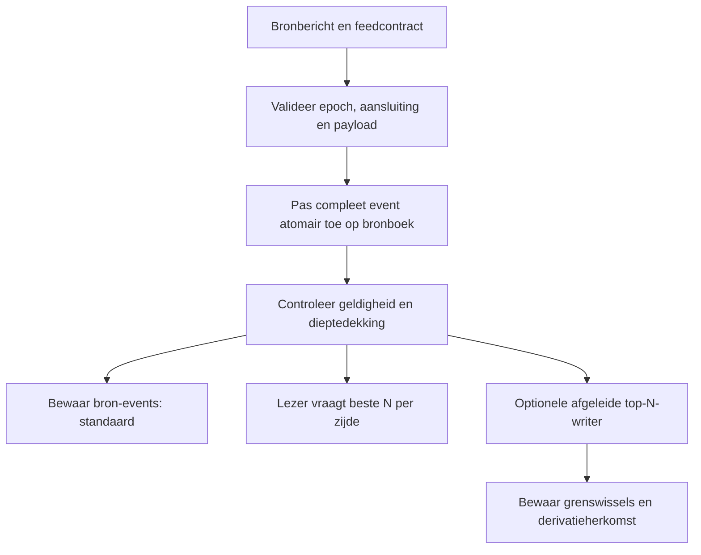

# Concept: instelbare orderboekdiepte voor `.gqodb.ob`

**Status:** breed diepteontwerp. Een eerste onafhankelijke L2-engine en offline
replay werken nu in gqodb-book/cli; zie actuele status.
De koppeling met de opslagcode en de volledige live keten hieronder ontbreken
nog. B06-compressieresultaten blijven metingen van levelrijen.

## 1. Diepte en standaardgedrag

Een laag is één prijsniveau aan één kant van het boek. Diepte 10 betekent maximaal
10 biedniveaus én 10 laatniveaus, dus maximaal 20 prijsniveaus. Een prijsniveau
bevat de samengevoegde hoeveelheid op die prijs; het is niet hetzelfde als één
individuele order. Het eerste profiel is L2; L3 met order-ID's blijft apart.

Tien is geen vaste limiet van gqodb. De publieke Bybit-documentatie beschrijft
bijvoorbeeld ook feeds met 1000 niveaus. Ondersteunde abonnementsdieptes moeten per
venue, product en feed worden gecontroleerd; dit voorbeeld bepaalt niet wat iedere
bron kan leveren. [Bybit orderbook-documentatie](https://bybit-exchange.github.io/docs/v5/websocket/public/orderbook).

**Standaard:** bewaar alle door de gekozen bron aangeleverde informatie. Een lezer
kan daaruit bijvoorbeeld de beste 10 niveaus per kant opvragen. Minder diep
opslaan is een afzonderlijke, expliciete keuze, geen automatische optimalisatie.
Volledige brondekking is niet hetzelfde als het volledige marktboek: een bron kan
zelf begrensd zijn of bepaalde liquiditeit niet publiceren.

| Keuze | Betekenis | Voorbeeld |
| --- | --- | --- |
| Brondiepte | Wat de feed volgens zijn contract levert | Maximaal 200 niveaus per zijde |
| Opslagdiepte | Wat deze dataset bewaart | `source` of expliciet `top_n=10` |
| Leesdiepte | Wat een reader opvraagt | Beste 10 uit een dieper opgeslagen boek |
| Werkelijk aantal | Hoeveel geldige niveaus nu bestaan/bekend zijn | 8 bied- en 6 laatniveaus |
| Resourcegrens | Hoeveel geheugen/events een proces mag gebruiken | Apart RAM-budget; geen impliciete dieptetruncatie |

Het formaat legt geen productlimiet van 10 vast. Aantallen en offsets krijgen
expliciete gecontroleerde grenzen; een implementatie kan grotere aanvragen
weigeren als schema, reader of budget die niet ondersteunt. Geen claim op
onbegrensde diepte of geheugen.

## 2. Normalisatie en identiteit

FIX is een optionele bronadapter en setupkeuze. ID-/positie-updates worden aan
de rand opgelost naar dit prijsboekmodel; de core blijft feedonafhankelijk.
Zie FIX-adaptercontract.

Gedeeld met `.gqodb.tick`: venue, instrument, stream, sessie/epoch, exacte prijzen
en hoeveelheden met afzonderlijke geversioneerde schaal, tijdseenheden en
bron-/ontvangstvolgorde. Null is geen nul. Delete-acties volgen het venuecontract.

Identiteit van een L2-level: `(venue, instrument, epoch, side, price)`.
Een rangnummer zoals "laag 10" is een afgeleid kenmerk dat kan verschuiven.
Dictionary-ID's zijn lokale compressiecodes, geen permanente level-ID's.
Aanpassingen aan prijs- of volumeschaal beginnen een nieuwe compatibele blokreeks.

De bidzijde wordt voor weergave van hoogste naar laagste prijs gerangschikt;
de askzijde van laagste naar hoogste. Die sorteervolgorde vervangt niet de
oorspronkelijke eventvolgorde. Gelijke timestamps blijven afzonderlijke events.

## 3. Metadata en antwoordcontract

De header identificeert `.ob`, L2 en container-/schemaversies. Geversioneerde
streammetadata en checkpoints leggen de dekking vast; veranderlijke volledigheid
wordt niet als één onveranderlijk waarheidsvlaggetje in de header opgeslagen.

| Metadata/antwoordveld (concept) | Doel |
| --- | --- |
| `source_depth` + feedcontractversie | Bekende bronlimiet per zijde, of expliciet onbekend |
| `storage_policy` | Alle broninformatie of een afgeleide top-N-dataset |
| `requested_depth` | Gevraagde leesdiepte per zijde |
| `returned_bid_levels`, `returned_ask_levels` | Werkelijk aantal teruggegeven niveaus |
| `coverage` per zijde | Gevalideerde top-N-dekking, bewezen leeg einde of onbekende grens |
| `epoch`, source sequence, availability watermark | Aan welke consistente toestand het antwoord is gekoppeld |
| `validity` + reden | Geldig, onvolledig, gap, resynchronisatie of onbekende dekking |
| `parent_dataset` + derivatieversie | Herkomst wanneer top-N bewust is afgeleid |

Bij `read_depth=10` mogen minder niveaus worden teruggegeven als het boek
aantoonbaar dunner is. Ontbrekende niveaus worden niet met nulvolumes opgevuld.
Onvoldoende bekende dekking is iets anders dan een werkelijk dun boek. Een
strikte read faalt bij onvoldoende dekking; een expliciete partial-read kan bekende
niveaus teruggeven met `validity=incomplete` en de reden. Nooit stilzwijgend doen
alsof top-10 volledige dekking biedt wanneer slechts top-5 bekend is.

Dieper lezen dan de dataset dekt levert geen gereconstrueerde of geschatte
niveaus op. Een dataset met alleen top-10 kan later niet tot top-200 worden
uitgebreid zonder een andere bron of opnieuw inlezen.

## 4. Live verwerking en het probleem aan de rand



Een delta bevat veranderde prijzen; het is doorgaans geen volledig nieuw top-N-
boek. Alleen updates bewaren waarvan de prijs op dat moment in top-10 staat
is daarom geen correcte algemene implementatie.

**Voorbeeld:** het beste biedniveau verdwijnt. Het eerdere niveau 11 wordt nu
niveau 10, ook als de bron geen update voor die prijs verstuurt. Een writer die
niveau 11 al had weggegooid, kan het nieuwe top-10-boek niet reconstrueren.

Daarom onderhoudt een afgeleide top-N-writer eerst de benodigde bronboektoestand
en berekent hij na ieder compleet bron-event de nieuwe top-N. Een klein extra
randbuffer garandeert geen juistheid bij willekeurig veel opeenvolgende deletes.
Als de bron zelf top-N levert, moet de adapter zijn specifieke aanvul-/vervangings-
regels volgen en kunnen aantonen dat de nieuwe grens nog volledig gedekt is.

De afgeleide stream bevat zowel echte veranderingen als niveaus die de gekozen
zichtgrens binnenkomen of verlaten. `view_evict` betekent "buiten de top-N-view"
en is geen bewijs van een cancel op de beurs. Binnenkomst bewaart de volledige
actuele hoeveelheid. Bronevent-ID, derivatieversie en eventgrens blijven behouden.
Ook een bron-event zonder zichtbare top-N-verandering behoudt een compacte
voortgangsmarkering, zodat geen onzichtbaar gat in de bronketen ontstaat.

**Gevolg:** top-N-opslag kan schijfruimte besparen, maar vermindert niet noodzakelijk
het geheugen dat nodig is om die top-N correct te onderhouden. De normale
leesprojectie uit volledige bronopslag heeft dit extra opslagcontract niet nodig.

## 5. Snapshots, delta's, resets en wijzigingen van diepte

Een bruikbaar bron-snapshot start/vervangt volgens de adapterregels een boek.
De snapshotdekking en aansluitregel zijn expliciet. Deltas worden pas als geldig
boek gepubliceerd als ze daarop aansluiten. Sequence-ID's hoeven niet bij iedere
venue aaneengesloten integers te zijn: de adapter controleert het echte contract.

Een reset, foutieve aansluiting of ontbrekend event maakt de betrokken toestand
ongeldig tot correcte resynchronisatie. Een latere snapshot repareert niet met
terugwerkende kracht wat een historische live lezer kon weten. Lege events en
controle-events blijven behouden, ook als er nul levelupdates zijn.

Een afgeleid checkpoint bewaart toestand, dekking, bronwatermark en epoch. Een
top-10-checkpoint is onvoldoende voor een top-200-query. Replay kiest een passend
checkpoint met voldoende dekking en verwerkt daarna events in causale volgorde.
Opslagkosten en generatiekosten van checkpoints tellen mee in de benchmark.

Een wijziging van bron- of opslagdiepte wordt geversioneerd en begint een nieuwe
segment-/beleidsgrens. Verdiepen vereist aantoonbaar voldoende huidige toestand
of resynchronisatie; eerdere ondiepe segmenten worden niet achteraf als diep
gelabeld. Versmallen verandert geen reeds gepubliceerde bestanden.

## 6. Conceptuele configuratie

Onderstaande YAML illustreert de keuze, maar is **nog geen ondersteunde parser**.
Positieve N-waarden worden aan het broncontract en de readercapaciteit getoetst.

```yaml
orderbook:
  storage:
    mode: source          # standaard: alle aangeleverde broninformatie
  reads:
    default_depth_per_side: 10
    require_complete: true
  workers: 1              # extra workers blijven optioneel
```

Bewust minder diep opslaan wordt een afzonderlijke dataset met expliciete
derivatieherkomst:

```yaml
orderbook:
  storage:
    mode: derived_top_n
    depth_per_side: 10
  reads:
    default_depth_per_side: 10
    require_complete: true
  workers: 1
```

Een grotere leestop-N, bijvoorbeeld 50/200/1000, is dezelfde interface met een
andere aanvraag; de dekking bepaalt of die geleverd kan worden. `source` is geen
toezegging dat de volledige beursdiepte beschikbaar is. RAM-/wachtrijlimieten zijn
afzonderlijke resource-instellingen. Bij overschrijding volgt het gekozen
backpressure-/foutcontract, nooit stilzwijgend minder boekdiepte opslaan.

## 7. Compressie per diepteprofiel

Dictionary-encoding van terugkerende prijzen/hoeveelheden, bitpacking, RLE en LZ4
zijn kandidaten binnen hetzelfde genormaliseerde schema. Snapshotblokken en
deltablokken krijgen afzonderlijke codecselectie. Dictionaries worden begrensd en
geversioneerd; decode-afhankelijkheden blijven lokaal genoeg voor selectief lezen.

Diepte 10 kan andere encodings of blokgroottes vragen dan 1000 niveaus. Dat is
een meetvraag, geen vooraf bewezen winst. Een andere codec moet exact dezelfde
logische events teruggeven. Een top-10-dataset vergelijken met volledig opgeslagen
Parquet en dat compressiewinst noemen is niet toegestaan: beide kanten krijgen
dezelfde diepte, projectie, tijdspanne en informatie.

Minder niveaus bewaren is bewuste informatiereductie. Het is geen verliesloze
compressiewinst ten opzichte van de oorspronkelijke diepere dataset. Binnen de
gekozen dataset blijft het codeccontract volledig verliesloos.

## 8. Acceptatie vóór implementatieclaims

| Test | Vereist resultaat |
| --- | --- |
| Depth-10 | Maximaal 10 bids en 10 asks, correct gerangschikt, bronidentiteit behouden |
| 10/50/200/1000 en source | Geen verborgen limiet van 10; expliciete capaciteit-/dekkingsfout waar nodig |
| Dun boek en lege zijde | Werkelijke aantallen, geen fictieve nulrijen; compleet versus onbekend onderscheiden |
| Delete beste niveau | Niveau N+1 schuift correct binnen na een compleet event |
| Insert vóór de grens | Oude grens verlaat de view zonder als beurscancel te worden gelabeld |
| Meerdere updates in één event | Geen onmogelijke tussentoestand zichtbaar voor readers |
| Update buiten top-N | Latere binnenkomst gebruikt de actuele hoeveelheid |
| Snapshot, gap, reset, lege delta | Epoch-/dekkingsstatus en eventgrenzen blijven aantoonbaar correct |
| Dieptewissel | Nieuwe metadata-/segmentgrens; geen verzonnen historische niveaus |
| Decode/replay | Exact gelijk aan een eenvoudige onafhankelijke referentiereconstructie |
| Meer workers | Identieke bytes/eventvolgorde; causale events van één boek worden niet ongeordend toegepast |
| Resourcegrens | Begrensd geheugen en expliciete fout/backpressure; geen verborgen dataverlies |

Benchmark per diepte: encode/decode-tijd, bytes inclusief indexen/dictionaries/
checkpoints, piek-RAM en reconstructietijd. Dictionary-LZ4 Parquet blijft de
verplichte sterke orderboekcontrole uit B06. Gebruik ontwikkelsamples én ongebruikte
controlesamples. Bestaande compressie behouden en nieuwe winst aantonen voordat
het concept als werkende `.gqodb.ob`-ondersteuning wordt gepresenteerd.
